# 🐾 Serverless Application on AWS (PetCuddleOTron )

This project demonstrates a serverless architecture deployed on AWS.  
It follows a pattern inspired by Adrian Cantrill’s *PetCuddleOTron*.

---

## 📌 Architecture Overview

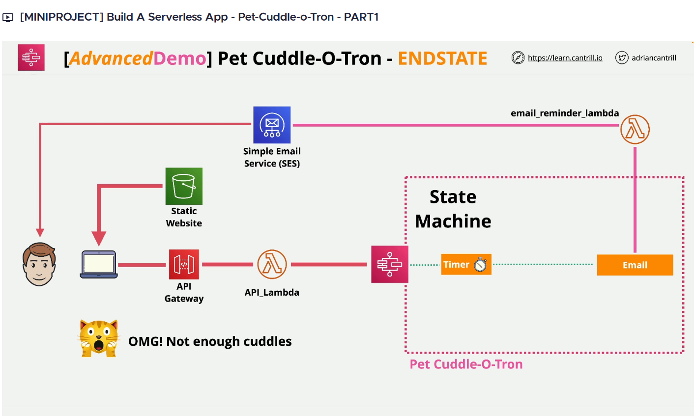

This serverless application integrates several AWS services to provide a scalable, event-driven solution:
- **Amazon S3** for static web hosting & storage
- **Amazon API Gateway** to expose secure APIs
- **AWS Lambda** for backend compute
- **AWS Step Functions** for orchestration
- **Amazon SES** for notifications
- **AWS IAM** for secure access control

---

## 📂 Services Used

### 1. Amazon S3 – Static Web Hosting
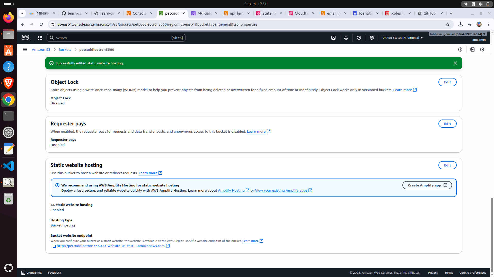

- Hosts the **frontend web application**.
- Stores static assets (HTML, CSS, JS, images).
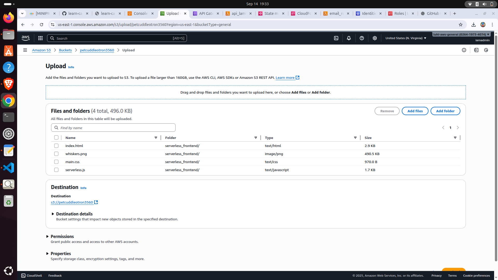

- Configured as a **serverless website bucket** with public access via S3 Website URL.
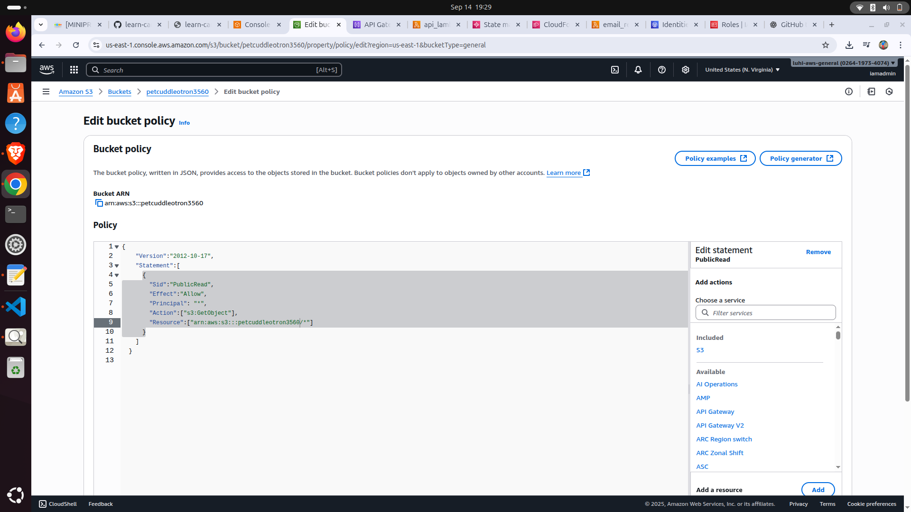

---

### 2. IAM – Roles & Permissions
- IAM Roles ensure **least privilege** access between services:
  - **Lambda Execution Role** → allows writing logs to CloudWatch & invoking Step Functions.
    
  - **Step Functions Role** → allows triggering Lambdas & accessing SES.  
    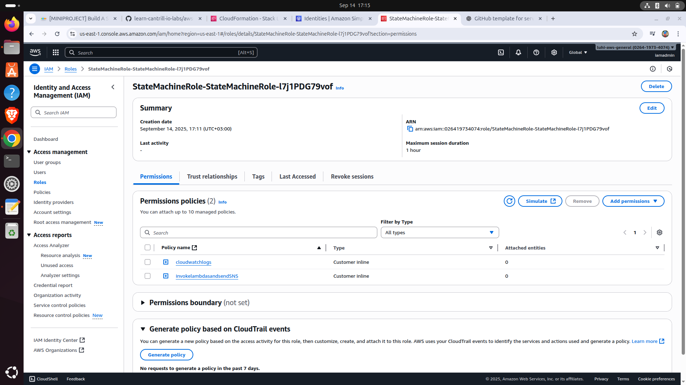
  
- Policies are **scoped tightly** to avoid over-permissioning.  

---

### 3. API Gateway – REST API
.png)
- Acts as the **entry point** for client requests.  
- Exposes REST endpoints that trigger backend **Lambda functions**.  
- Configured with:
  - **CORS support** (for browser requests).  
  - **Stage variables & logging** for debugging.  

---

### 4. AWS Lambda – Business Logic
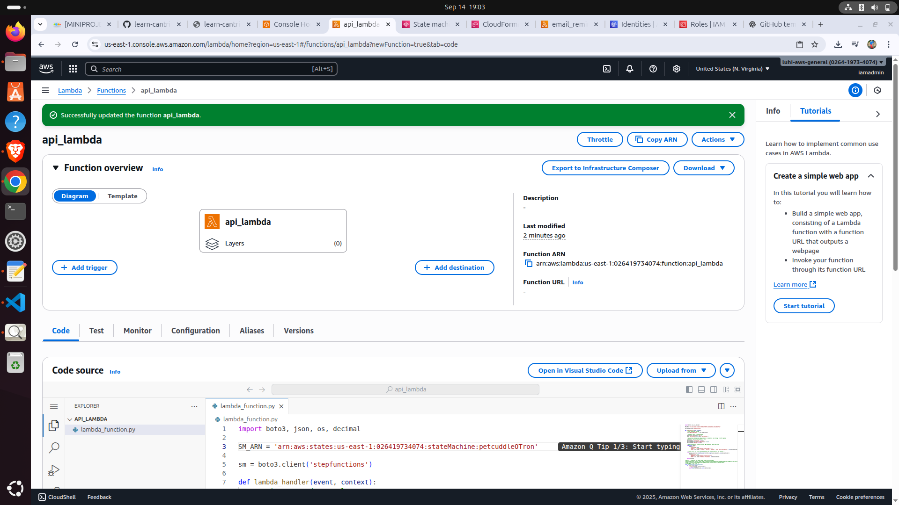

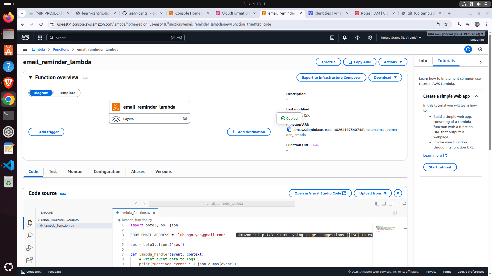

- Lambda functions power the **serverless backend**.  
- Key responsibilities:
  - Process API Gateway requests.  
  - Execute workflow steps inside **Step Functions**.  
  - Send notifications via **SES**.  
- Uses **IAM execution role** for controlled access.  

---

### 5. AWS Step Functions – Workflow Orchestration
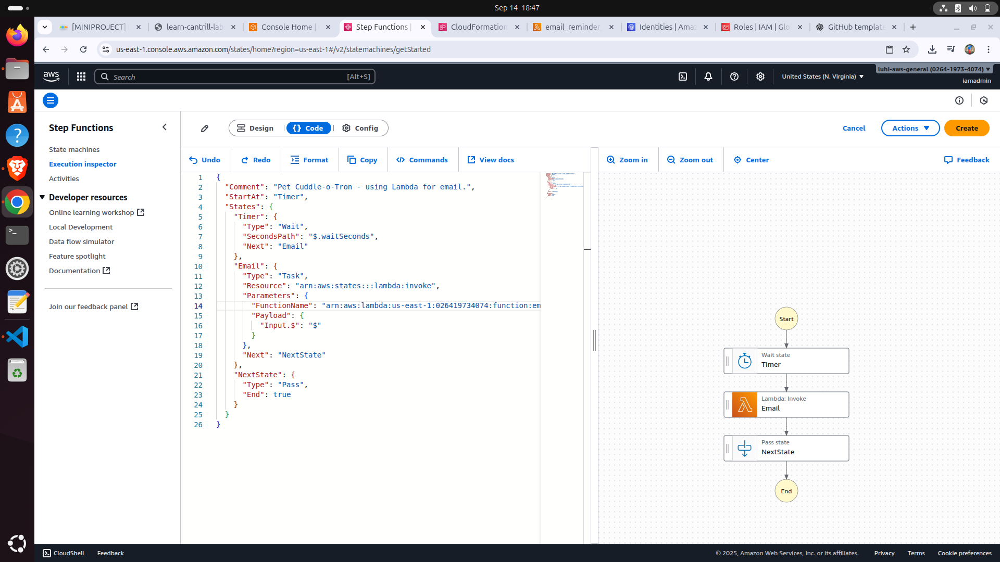

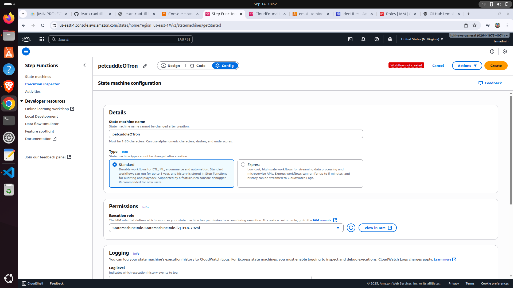

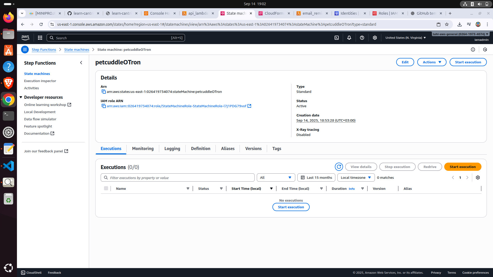

- Manages the **business workfStepFunctionConfig.pnglow** (like PetCuddleOTron cuddle sequence 🐶🐱).  
- Each step invokes different **Lambda functions**.  
- Provides:
  - **State tracking**  
  - **Error handling & retries**  
  - **Logging & debugging** via Execution History  

---

### 6. Amazon SES  – Notifications
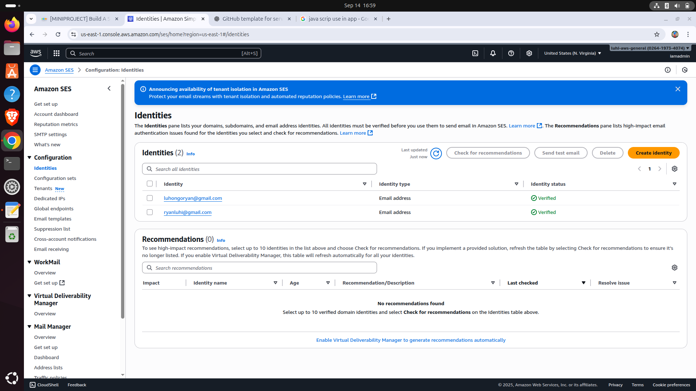

- **Amazon SES** sends out email notifications (e.g., “Pet cuddle request completed”).  
- Integrated with **Step Functions** for automated messaging at workflow completion.  

---

## 📝 Project Flow

1. User interacts with **frontend (S3 hosted)**.  
2. Request is sent via **API Gateway** → triggers **Lambda**.  
3. Lambda calls a **Step Functions workflow**.  
4. Workflow coordinates multiple **Lambdas** for different steps.  
5. On completion, **SES sends notification** to the user.  

---

## 🚀 How to Run This Project

1. Clone this repo.  
2. Deploy resources using **CloudFormation / Terraform / CDK** (your choice).  
3. Upload static assets to **S3 bucket**.  
4. Configure **API Gateway endpoints**.  
5. Deploy **Step Function workflow** and integrate with Lambda.  
6. Test end-to-end by triggering from the frontend.  

---

## 🎯 Reference
- Inspired by [Adrian Cantrill’s](https://learn.cantrill.io)

